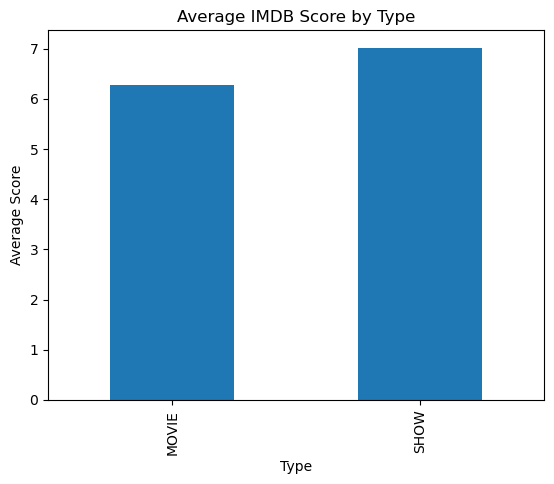

# Netflix IMDB Data Analysis

## Dataset Source
This dataset comes from Kaggle and contains Netflix TV shows and movies with IMDB ratings.

## About Script
This script is designed by Saatwik Mehta and analyzes the dataset below to present findings by using graphs and descriptive statistics.


# Importing the Data


```python
import pandas as pd
import matplotlib.pyplot as plt

df = pd.read_csv("data/NetflixIMDB.csv")
df.head() # Makes sure that data is correctly imported

```


<div>
<style scoped>
    .dataframe tbody tr th:only-of-type {
        vertical-align: middle;
    }

    .dataframe tbody tr th {
        vertical-align: top;
    }

    .dataframe thead th {
        text-align: right;
    }
</style>
<table border="1" class="dataframe">
  <thead>
    <tr style="text-align: right;">
      <th></th>
      <th>index</th>
      <th>id</th>
      <th>title</th>
      <th>type</th>
      <th>description</th>
      <th>release_year</th>
      <th>age_certification</th>
      <th>runtime</th>
      <th>imdb_id</th>
      <th>imdb_score</th>
      <th>imdb_votes</th>
    </tr>
  </thead>
  <tbody>
    <tr>
      <th>0</th>
      <td>0</td>
      <td>tm84618</td>
      <td>Taxi Driver</td>
      <td>MOVIE</td>
      <td>A mentally unstable Vietnam War veteran works ...</td>
      <td>1976</td>
      <td>R</td>
      <td>113</td>
      <td>tt0075314</td>
      <td>8.3</td>
      <td>795222.0</td>
    </tr>
    <tr>
      <th>1</th>
      <td>1</td>
      <td>tm127384</td>
      <td>Monty Python and the Holy Grail</td>
      <td>MOVIE</td>
      <td>King Arthur, accompanied by his squire, recrui...</td>
      <td>1975</td>
      <td>PG</td>
      <td>91</td>
      <td>tt0071853</td>
      <td>8.2</td>
      <td>530877.0</td>
    </tr>
    <tr>
      <th>2</th>
      <td>2</td>
      <td>tm70993</td>
      <td>Life of Brian</td>
      <td>MOVIE</td>
      <td>Brian Cohen is an average young Jewish man, bu...</td>
      <td>1979</td>
      <td>R</td>
      <td>94</td>
      <td>tt0079470</td>
      <td>8.0</td>
      <td>392419.0</td>
    </tr>
    <tr>
      <th>3</th>
      <td>3</td>
      <td>tm190788</td>
      <td>The Exorcist</td>
      <td>MOVIE</td>
      <td>12-year-old Regan MacNeil begins to adapt an e...</td>
      <td>1973</td>
      <td>R</td>
      <td>133</td>
      <td>tt0070047</td>
      <td>8.1</td>
      <td>391942.0</td>
    </tr>
    <tr>
      <th>4</th>
      <td>4</td>
      <td>ts22164</td>
      <td>Monty Python's Flying Circus</td>
      <td>SHOW</td>
      <td>A British sketch comedy series with the shows ...</td>
      <td>1969</td>
      <td>TV-14</td>
      <td>30</td>
      <td>tt0063929</td>
      <td>8.8</td>
      <td>72895.0</td>
    </tr>
  </tbody>
</table>
</div>


# First Look at Dataset


```python
df.info() #shows general overview of the dataset
df.shape #shows the amount of rows and columns


```

    <class 'pandas.core.frame.DataFrame'>
    RangeIndex: 5283 entries, 0 to 5282
    Data columns (total 11 columns):
     #   Column             Non-Null Count  Dtype  
    ---  ------             --------------  -----  
     0   index              5283 non-null   int64  
     1   id                 5283 non-null   object 
     2   title              5283 non-null   object 
     3   type               5283 non-null   object 
     4   description        5278 non-null   object 
     5   release_year       5283 non-null   int64  
     6   age_certification  2998 non-null   object 
     7   runtime            5283 non-null   int64  
     8   imdb_id            5283 non-null   object 
     9   imdb_score         5283 non-null   float64
     10  imdb_votes         5267 non-null   float64
    dtypes: float64(2), int64(3), object(6)
    memory usage: 454.1+ KB
    


    (5283, 11)


# Check for Missing Values


```python
df.isna().sum().sort_values(ascending=False) #Checks for total missing values per column then sorts by the column with the most missing

# age_certificiation is missing a lot of values and it may affect analysis if used
```


    age_certification    2285
    imdb_votes             16
    description             5
    index                   0
    id                      0
    title                   0
    type                    0
    release_year            0
    runtime                 0
    imdb_id                 0
    imdb_score              0
    dtype: int64


## Data Summaries

In this section, I will answer some questions about the dataset, such as:

- How many movies vs TV shows are there?
- What is the average IMDB score?
- Do movies and shows have different average scores?


### Counts of Movies vs TV shows


```python
CountDiff = df["type"].value_counts()
print("There are", CountDiff["MOVIE"],"Movies")
print("There are", CountDiff["SHOW"],"TV Shows")


```

    There are 3407 Movies
    There are 1876 TV Shows
    

### Avg IMDB Rating across all movies and TV shows


```python
avgscore = df["imdb_score"].mean()
print("Average IMDB rating in the dataset is", round(avgscore, 2), "/ 10")
```

    Average IMDB rating in the dataset is 6.53 / 10
    

### Comparing Average IMDB score between movies and TV shows


```python
AvgType = df.groupby("type")["imdb_score"].mean()
print("Average IMDB score for Movies:", round(AvgType["MOVIE"], 2))
print("Average IMDB score for TV Shows:", round(AvgType["SHOW"], 2))

```

    Average IMDB score for Movies: 6.27
    Average IMDB score for TV Shows: 7.02
    

## Visualizations

The following graphs help visualize the summaries from above.


```python
## Bar chart that shows the diffrence between how many movies and tv shows there are
CountDiff.plot(kind="bar")
plt.title("Number of Movies vs TV Shows on Netflix")
plt.xlabel("Type")
plt.ylabel("Count")
plt.show()


```


    

    


This bar chart shows that Netflix has more movies than TV shows in this dataset.


```python
df["imdb_score"].dropna().hist(bins=20)
plt.title("Distribution of IMDB Scores")
plt.xlabel("IMDB Score")
plt.ylabel("Number of Titles")
plt.show()

```


    

    


This histogram shows how IMDB ratings are spread across Netflix titles.
Most ratings appear to be between about 5 and 8.


```python
AvgType.plot(kind="bar")
plt.title("Average IMDB Score by Type")
plt.xlabel("Type")
plt.ylabel("Average Score")
plt.show()

```


    

    


This graph compares the average IMDB ratings of movies and TV shows.
TV shows have a higher average rating than movies in this dataset.


## Summary of Findings

By building this script and analyzing this dataset I found out that: 

- There are more movies than TV shows on Netflix
- The average IMDB rating across all titles is about 6.53 out of 10
- TV shows have higher average ratings than movies
- Most IMDB scores fall between about 5 and 8


